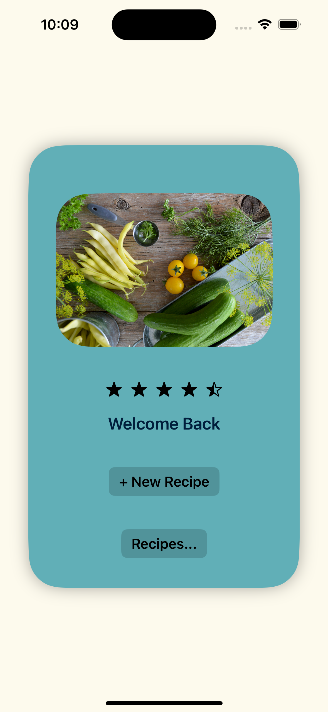
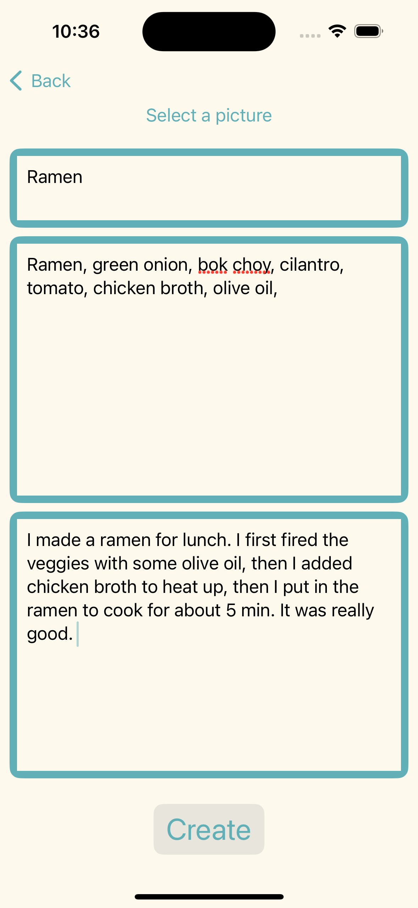
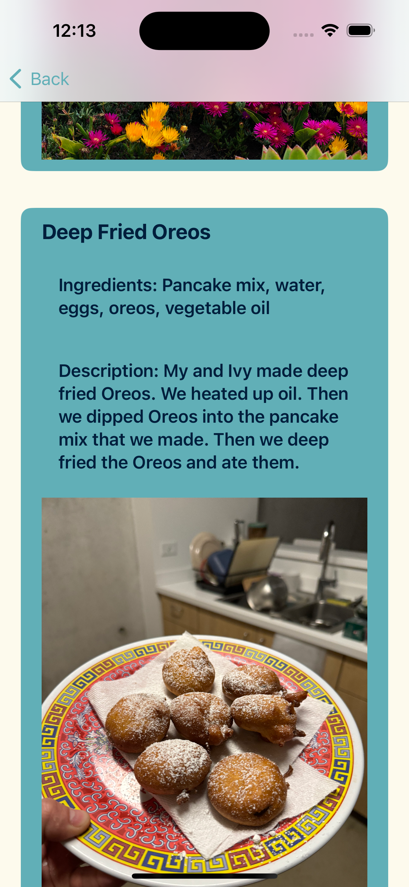

## Overview

The MyRecipes app is a simple, user-friendly iOS application that allows users to create, manage, and view their favorite recipes. The app provides functionality to add recipes with details such as title, ingredients, description, and an image. It saves the recipes locally on the device, ensuring that users can access their recipe collection anytime, even offline.

## Features

- ***Home Page***: Welcome page with navigation options to add new recipes or view existing recipes.
- ***Add Recipe***: Users can input the title, ingredients, description, and an image for their recipe.
- ***View Recipes***: A list of all saved recipes, each displaying its details and image.
- ***Local Storage***: Recipes are saved locally on the device using UserDefaults and file storage for images.


## Screenshots
<p align="center">
  
  
  
</p>

## Installation

1. Clone the repository:

```
git clone https://github.com/Sebastientg/MyRecipes-App.git
```

2. Navigate to the project directory:

```
cd MyRecipes-App
```

3. Open the project in Xcode:

```
open Recipes.xcodeproj
```

4. Build and run the project on your simulator or connected device.


## Code Structure

### HomePage.swift

This file contains the HomePage view, which serves as the landing page for the app. It includes navigation links to add a new recipe or view existing recipes.

### RecipeInputPage.swift

This file contains the RecipeInputPage view, where users can input details for a new recipe and select an image from their photo library.

### RecipesPage.swift

This file contains the RecipesPage view, which displays a list of all saved recipes with their details and images.

### Recipe.swift

This file defines the Recipe struct, which represents a recipe with properties for title, ingredients, description, and image name.

### RecipeManager.swift

This file defines the RecipeManager class, which handles the logic for adding, saving, and loading recipes. It uses UserDefaults for data persistence and manages images using the file system.

## Usage

1. ***Open the app*** to the Home Page.
  
2. ***Add a new recipe*** by tapping on "+ New Recipe" and filling out the details.
   
3. ***View saved recipes*** by tapping on "Recipes..." to see a list of all your recipes.

## Acknowledgments

Inspired personal interest in recipe management and cooking. This was a project to enhance my SwiftUI skills and understanding of iOS development. This was one of my first projects made from scratch. 

